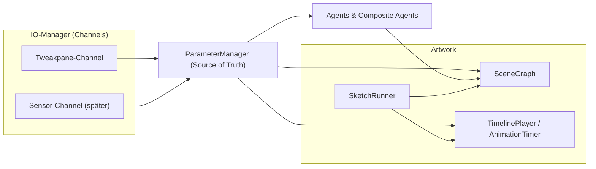
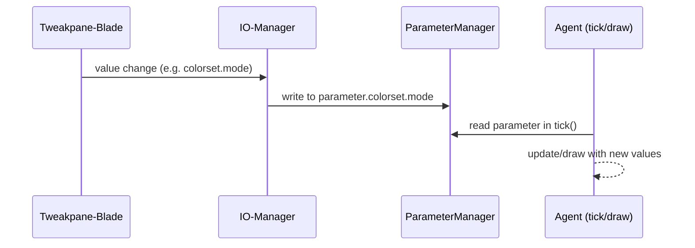

# README

Kurzer Überblick über die aktuelle cc-toolbox-Architektur.

## Ziele

- Einheitliche Basis für 2D-Artworks (statisch/dynamisch); später erweiterbar.
- Eine Quelle der Wahrheit: Parameter-Objekt, das alle Eingänge bündelt.
- Austauschbare UI/Inputs (Tweakpane heute, Sensoren/React o.ä. morgen).
- Klare Bausteine: Agents, SceneGraph, Timeline, IO, Parameter.

## High-Level Architektur



## Kernbausteine

### Artwork + SketchRunner

- Startet Canvas, Tweakpane, IO, TimelinePlayer.
- SketchRunner ruft pro Frame `tickScene()` oder `scene.tick()` auf.
- Globaler Halt im Parameter (`artwork.animation.global_halt`).
- [ ] Playhead-UI für Timeline (Play/Pause/Scrub/Speed) ausbauen.

### Parameter-Objekt

- Verschachtelte ParameterSets je Modul (format, colorset, background, grid, animation…).
- Wird vom IO-Manager geschrieben und von allen Komponenten gelesen.
- Speichern/Laden = reproduzierbares Artwork.
- [ ] Serializer (Preset-Export/import), Validierung, Schema-Doku.

### IO-Manager

- Channels registrieren sich selbst (z.B. Tweakpane).
- Bindings definieren, wohin Werte im Parameter-Objekt gemappt werden.
- Echtzeit-Einspeisung (UI, Sensoren, Netzwerk) ohne Agent-Code anzufassen.
- [ ] Mapping-Presets, Logging/Tracing-Schalter, Simulationsquellen.

### Tweakpane-Manager (UI-Modul)

- Baut Module/Folders, mappt UI-States auf Parameter via IO-Manager.
- Austauschbar (kann später durch andere UIs ersetzt werden).
- [ ] Theming, dynamische Module ein/aus, Preset-Blades.

### Agents und CompositeAgents

- `Agent`-Interface: `update?`, `draw`, `onCollision?`.
- CompositeAgent verwaltet Kind-Agents (z.B. Grids, Particle-Systeme).
- Agents holen sich alles über das Parameter-Objekt; keine direkten UI-Kopplungen.
- [ ] Kollision/Physik-Hooks, Messaging zwischen Agents, Z-Layering.

### SceneGraph

- Flache oder 2D-Liste, ruft `update()` (wenn vorhanden) und `draw()` pro Node.
- Keine Observer mehr; Steuerung läuft über Parameter + Tick.
- [ ] Z-Order/Layer, Culling, Offscreen-Buffers.

### Animation

- `AnimationTimer`: gedrosselte Wiederholer für „slow“ Aktionen (z.B. Colorset-Wechsel).
- `AnimationTimeline` + `TimelinePlayer`: zeitgesteuerte Segmente, zentral im Artwork verdrahtet.
- [ ] Mehr Segmente (Ease, Curves), Keyframes exportierbar, Agent-Bindings vereinfachen.

## Wichtige Module

- Format: Papiergrößen, DPI, Aspect-Ratio; registriert eigene Tweakpane-Controls.
- Background: nutzt Colorset oder Custom-Farbe; hängt im SceneGraph.
- ColorSet: Paletten + Modi (custom, group, all); Timer-Animation optional.
- Grid/Entities/Particles/Shapes: Agents bzw. CompositeAgents, die sich an SceneGraph/Tick halten.
- Exporter: Render/Save;
  - [ ] TODO Druck/Vector?

## Beispiel: Minimaler Sketch (SceneGraph)

```ts
class MySketch {
  scene = new SceneGraph();
  useSceneGraph = true;
  private bg: Background;
  private colors: ColorSet;

  prepare(ctx, parameter, format, tweakpane, ui) {
    ColorSet.ensureParameterSet(parameter);
    Background.ensureParameterSet(parameter);
    this.bg = new Background(parameter);
    this.colors = new ColorSet(parameter);

    ui?.manager &&
      ColorSet.registerTweakpane(parameter, ui.manager, { container: ui.pane });
    ui?.manager &&
      Background.registerTweakpane(parameter, {
        manager: ui.manager,
        container: ui.pane,
      });

    this.scene.push(this.bg);
  }

  tickScene(ctx, parameter, t, dt) {
    this.colors.animationTimer.check_AnimationTimer(
      t,
      dt,
      parameter.artwork.animation.global_halt,
      parameter.colorset
    );
    this.colors.check_ObserverSubject(parameter.colorset);
    this.scene.tick(ctx, parameter, dt);
  }
}
```

## Beispiel: Timeline-Use

```ts
// Im prepare: zentralen TimelinePlayer aus parameter.__timelinePlayer verwenden
parameter.__timelinePlayer?.add({
  id: "flash-bg",
  from: 0,
  to: 5,
  onTick: (p) => {
    p.background.color = "#ff0000AA";
  },
  loop: true,
});
```

## Datenfluss Tweakpane → Parameter → Agent



## TODO (gesamt)

- [ ] Playhead/Timeline-UI verfeinern (Scrub, Speed, Loop-Modi).
- [ ] Serializer für Parameter (Presets speichern/laden).
- [ ] Physik/Kollision-Hooks und Messaging zwischen Agents.
- [ ] SceneGraph mit Layer/Z-Order und optional Offscreen-Rendering.
- [ ] IO-Manager: Mapping-Presets, Sensor-Simulation, Debug-Overlay.
- [ ] Tests/Beispiele für jedes Modul (001–006 + neue).

## Ausblick

- [ ] GUI mit Node-Editor
