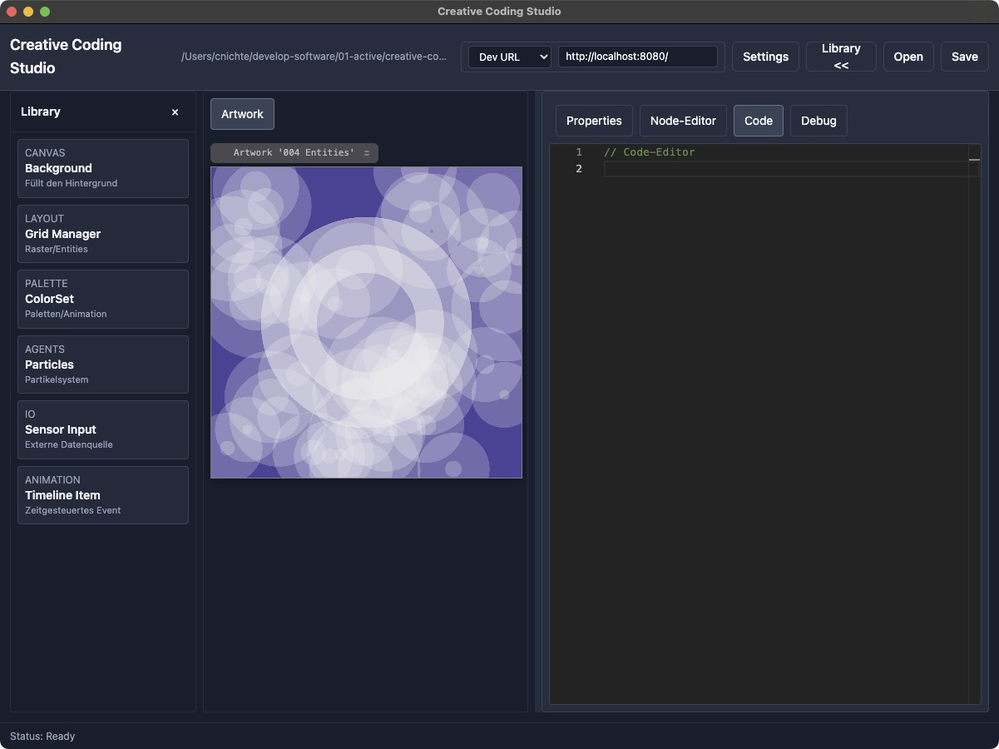
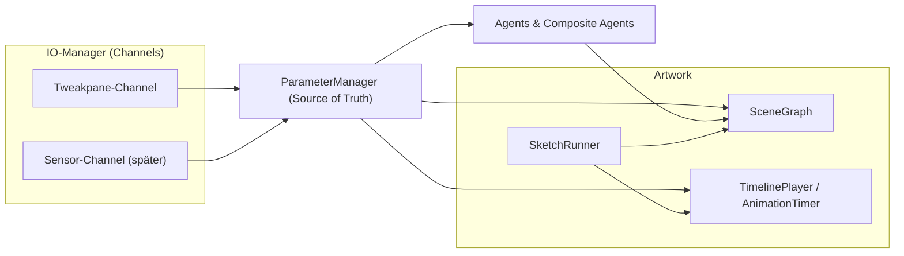
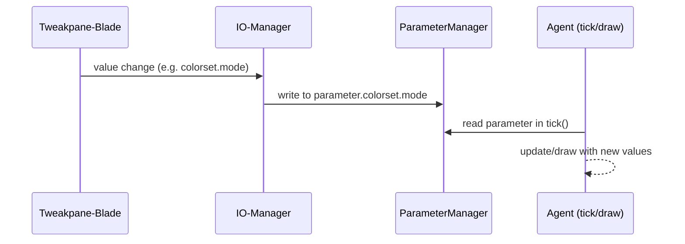

# creative-coding

- Project : Creative Coding
- Author : Carsten Nichte
- Date : 2022 - to date
- Web : <https://carsten-nichte.de/index/>

## Description

Creative-Coding Projects for HTML Canvas, with focus more on organisation and structure than on speed.

Navigate to one of the projects folder in the Terminal, and from there:

- For Development:
- Start watch: `yarn run watch` - live-reload without server
- Start Server: `yarn run start` - live-reload with server
- For Production:
  - Build release:`yarn run build` - build the code for production

## Made with love and the great

- YARN 2
- Webpack 5
- Typescript 5.2
- Electron, React
- <https://github.com/cocopon/tweakpane>
- <https://github.com/mattdesl/canvas-sketch-util>

Learn, code, create, and have fun.

## The Creative Coding Studio

Is heavy under developmment at the moment.



## CC-Toolbox

Brief overview of the current cc-toolbox architecture.

## Objectives

- Uniform basis for 2D artwork (static/dynamic); expandable later.
- One source of truth: parameter object that bundles all inputs.
- Interchangeable UI/inputs (Tweakpane today, sensors/React or similar tomorrow).
- Clear building blocks: agents, SceneGraph, timeline, IO, parameters.

## High-Level Architektur



## Core Components

### Artwork + SketchRunner

- Starts Canvas, Tweakpane, IO, TimelinePlayer.
- SketchRunner calls `tickScene()` or `scene.tick()` per frame.
- Global halt in parameter (`artwork.animation.global_halt`).
- [ ] Extend playhead UI for timeline (play/pause/scrub/speed).

### Parameter-Object

- Nested parameter sets per module (format, colourset, background, grid, animation, etc.).
- Written by the IO manager and read by all components.
- Save/load = reproducible artwork.
- [ ] Serialiser (preset export/import), validation, schema documentation.

### IO-Manager

- Channels register themselves (e.g. Tweakpane).
- Bindings define where values are mapped in the parameter object.
- Real-time feed (UI, sensors, network) without touching agent code.
- [ ] Mapping presets, logging/tracing switches, simulation sources.

### Tweakpane-Manager (UI-Modul)

- Builds modules/folders, maps UI states to parameters via IO Manager.
- Interchangeable (can be replaced by other UIs later).
- [ ] Theming, dynamic modules on/off, preset blades.

### Agents und CompositeAgents

- `Agent` interface: `update?`, `draw`, `onCollision?`.
- CompositeAgent manages child agents (e.g. grids, particle systems).
- Agents get everything via the parameter object; no direct UI couplings.
- [ ] Collision/physics hooks, messaging between agents, Z-layering.

### SceneGraph

- Flat or 2D list, calls `update()` (if available) and `draw()` per node.
- No more observers; control is via parameters + tick.
- [ ] Z-order/layer, culling, offscreen buffers.

### Animation

- `AnimationTimer`: throttled repeaters for "slow" actions (e.g. colourset changes).
- `AnimationTimeline` + `TimelinePlayer`: time-controlled segments, centrally wired in the artwork.
- [ ] More segments (ease, curves), exportable keyframes, simplified agent bindings.

## Wichtige Module

- Format: paper sizes, DPI, aspect ratio; registers own tweakpane controls.
- Background: uses colourset or custom colour; hangs in SceneGraph.
- ColourSet: palettes + modes (custom, group, all); timer animation optional.
- Grid/Entities/Particles/Shapes: agents or composite agents that adhere to SceneGraph/Tick.
- Exporter: render/save;
- [ ] TODO print/vector?

## Beispiel: Minimaler Sketch (SceneGraph)

```ts
class MySketch {
  scene = new SceneGraph();
  useSceneGraph = true;
  private bg: Background;
  private colors: ColorSet;

  prepare(ctx, parameter, format, tweakpane, ui) {
    ColorSet.ensureParameterSet(parameter);
    Background.ensureParameterSet(parameter);
    this.bg = new Background(parameter);
    this.colors = new ColorSet(parameter);

    ui?.manager &&
      ColorSet.registerTweakpane(parameter, ui.manager, { container: ui.pane });
    ui?.manager &&
      Background.registerTweakpane(parameter, {
        manager: ui.manager,
        container: ui.pane,
      });

    this.scene.push(this.bg);
  }

  tickScene(ctx, parameter, t, dt) {
    this.colors.animationTimer.check_AnimationTimer(
      t,
      dt,
      parameter.artwork.animation.global_halt,
      parameter.colorset
    );
    this.colors.check_ObserverSubject(parameter.colorset);
    this.scene.tick(ctx, parameter, dt);
  }
}
```

## Example: Timeline use

```ts
// Im prepare: zentralen TimelinePlayer aus parameter.__timelinePlayer verwenden
parameter.__timelinePlayer?.add({
  id: "flash-bg",
  from: 0,
  to: 5,
  onTick: (p) => {
    p.background.color = "#ff0000AA";
  },
  loop: true,
});
```

## Data flow Tweakpane → Parameters → Agent



## TODO (overall)

- [ ] Refine playhead/timeline UI (scrub, speed, loop modes).
- [ ] Serialiser for parameters (save/load presets).
- [ ] Physics/collision hooks and messaging between agents.
- [ ] SceneGraph with layer/Z-order and optional offscreen rendering.
- [ ] IO manager: mapping presets, sensor simulation, debug overlay.
- [ ] Tests/examples for each module (001–006 + new).


## Licence

This is a "marketing version".

### License & Usage Permissions

This project is licensed under the MIT License.
This means:

- You can use this tool for any purpose — personal, educational, or commercial.
- You can sell, mint, exhibit and publish artworks created with this software.
- You can modify the code, fork it, or include it in your own projects.
- No attribution is required for artworks (although appreciated).
- The code is provided “as is”, without warranty.

### Important: Your art belongs to you

All artworks, renders, prints, videos or installations created using this software are 100% your property.
You may:

- Sell or license them
- Use them in exhibitions
- Use them in commercial projects
- Publish or mint them as NFTs (if you’re into that)
- Use them in client work

The software does not impose any restrictions on the commercial use of the creative output.

### Example Artworks

Any example images, demo renders or illustrations included in this repository (if any) remain © by their respective authors and may have separate permissive licenses.

## Pages

- <https://carsten-nichte.de/apps/creative-code/>
- <https://carsten-nichte.de/apps/docs/creative-code-projekt-dokumentation/>
- <https://carsten-nichte.de/#generative-art>
- <https://carsten-nichte.de/notes/artikel/generative-art-creative-code/>